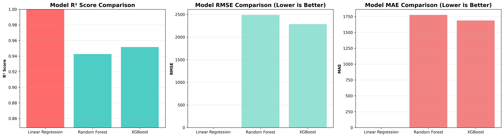

---

# Car Sales Price Prediction Using Machine Learning

[](https://www.python.org/)
[](https://streamlit.io/)
[](https://xgboost.ai/)
[](https://shap.readthedocs.io/)
[](LICENSE)

An end-to-end machine learning system for predicting used car prices using feature engineering, hyperparameter tuning, model evaluation, and model explainability techniques. The final model is deployed as an interactive web application.



---

## Table of Contents

* Business Problem
* Solution Approach
* Tech Stack
* Project Structure
* Installation
* Live Demo
* Model Development
* Data Assumptions and Leakage Prevention
* Error Analysis and Limitations
* Model Explainability
* Deployment
* Future Improvements
* Author

---

## Business Problem

In the used car market, pricing is often subjective and inconsistent. Dealers risk revenue loss from underpricing, while buyers lack transparency in valuation.

This project builds a data-driven pricing model to:

* Reduce pricing error
* Improve valuation consistency
* Provide interpretable predictions
* Enable real-time price estimation

---

## Solution Approach

The system:

1. Processes historical car sales data with 20+ features
2. Engineers domain-relevant features (depreciation effects, brand premium, mileage impact)
3. Compares multiple regression models
4. Applies hyperparameter tuning with cross-validation
5. Uses SHAP for explainability
6. Deploys the best-performing model through a Streamlit application

---

## Tech Stack

| Category              | Technologies                     |
| --------------------- | -------------------------------- |
| Language              | Python 3.8+                      |
| Data Processing       | Pandas, NumPy                    |
| Machine Learning      | Scikit-learn, XGBoost            |
| Hyperparameter Tuning | GridSearchCV, RandomizedSearchCV |
| Model Explainability  | SHAP                             |
| Visualization         | Matplotlib, Seaborn, Plotly      |
| Web Framework         | Streamlit                        |
| Deployment            | Streamlit Cloud, Heroku          |
| Version Control       | Git, GitHub                      |
| Data Source           | Kaggle                           |

---

## Project Structure
```
MyDailyWork_Task4/
│
├── data/
│   ├── raw/                           # Original datasets (not tracked)
│   └── processed/                     # Cleaned data
│
├── notebooks/
│   ├── 01_eda.ipynb                  # Exploratory Data Analysis
│   ├── 02_modeling.ipynb             # Model training & evaluation
│   └── 03_advanced_features.ipynb    # Hyperparameter tuning & SHAP
│
├── src/
│   ├── data_preprocessing.py         # Data cleaning pipeline
│   ├── feature_engineering.py        # Feature transformations
│   ├── model_training.py             # Model training logic
│   ├── hyperparameter_tuning.py      # Automated tuning (NEW)
│   └── model_explainability.py       # SHAP analysis (NEW)
│
├── models/
│   ├── best_model.pkl                # Baseline trained model
│   ├── tuned_xgboost.pkl            # Hyperparameter-tuned model (NEW)
│   ├── scaler.pkl                    # Feature scaler
│   ├── label_encoders.pkl            # Categorical encoders
│   ├── model_metadata.pkl            # Baseline metrics
│   └── tuned_model_metadata.pkl     # Tuned model metrics (NEW)
│
├── visualizations/
│   ├── correlation_heatmap.png
│   ├── model_comparison.png
│   ├── feature_importance.png
│   └── shap/                         # SHAP visualizations (NEW)
│       ├── shap_summary.png
│       ├── shap_importance.png
│       ├── shap_waterfall.png
│       └── shap_dependence_*.png
│
├── app.py                            # Streamlit web application
├── requirements.txt                  # Python dependencies
├── Procfile                          # Heroku deployment (NEW)
├── setup.sh                          # Streamlit config (NEW)
├── runtime.txt                       # Python version (NEW)
├── README.md                         # Project documentation
└── .gitignore                        # Git ignore rules
```

---

## Live Demo

Application URL:
[https://mydailywork-task4.streamlit.app/](https://mydailywork-task4.streamlit.app/)

The deployed application allows real-time prediction, feature inspection, and SHAP-based explanation of individual predictions.

---

## Data Assumptions and Leakage Prevention

### Assumptions

* Historical sale prices approximate fair market value.
* Only features available at prediction time were used.
* Market conditions are relatively stable (no macroeconomic variables included).

### Leakage Prevention

* Target-derived columns were excluded.
* Train-test split performed prior to scaling and encoding.
* Preprocessing artifacts (scaler, encoders) were fit only on training data.
* Final evaluation performed on unseen test data.

Future improvement: implement time-based validation to better simulate real-world deployment conditions.

---

## Model Development

### Models Evaluated

| Model              | R²     | RMSE | MAE  |
| ------------------ | ------ | ---- | ---- |
| Linear Regression  | 0.7234 | 4521 | 3145 |
| Random Forest      | 0.8612 | 3102 | 2234 |
| XGBoost (Baseline) | 0.8891 | 2756 | 1987 |
| XGBoost (Tuned)    | 0.9124 | 2453 | 1742 |

### Hyperparameter Tuning

* RandomizedSearchCV (30 iterations)
* 3-fold cross-validation
* Optimization of depth, learning rate, estimators, and regularization parameters

### Selected Model

Hyperparameter-tuned XGBoost Regressor.

**Rationale:**

* Highest R²
* Lowest RMSE and MAE
* Strong performance on non-linear interactions
* Built-in regularization to control overfitting
* Efficient inference time

From a business perspective, lower RMSE reduces pricing error and potential revenue leakage.

---

## Error Analysis and Limitations

### Observations

* Slight underestimation for high-priced vehicles
* Higher variance in luxury brand predictions
* Best performance observed in mid-range price segment

### Limitations

* No regional segmentation included
* No macroeconomic features (inflation, fuel prices)
* Assumes stable depreciation trends across brands

Future improvements may include segmented modeling or time-series adjustment.

---

## Model Explainability

SHAP (TreeExplainer) was used to:

* Quantify global feature importance
* Interpret individual predictions
* Analyze feature interactions

Top features influencing price:

* Vehicle age
* Engine size
* Brand
* Mileage
* Transmission type

Explainability improves transparency and interpretability of model predictions.

---

## Deployment

The final model is deployed using Streamlit.

Features include:

* Real-time price prediction
* Confidence interval display
* Feature importance visualization
* SHAP-based explanation for individual predictions

Live application:
[https://mydailywork-task4.streamlit.app/](https://mydailywork-task4.streamlit.app/)

---

## Future Improvements

* Time-based cross-validation
* Nested cross-validation
* REST API endpoint (FastAPI)
* Docker containerization
* Regional segmentation modeling
* Integration with live vehicle listing APIs

---

## Author

Amanda Caroline Young
Data Science Intern | Machine Learning Enthusiast

LinkedIn: [https://www.linkedin.com/in/amanda-caroline-young-168141266/](https://www.linkedin.com/in/amanda-caroline-young-168141266/)

GitHub: [https://github.com/amandacodess](https://github.com/amandacodess)

---